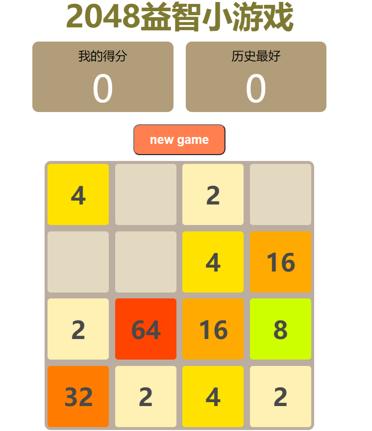

# 2048小游戏
2048小游戏（带动画效果）
所用语言html、css、JavaScript
通过上下左右进行控制，实现了移动、合并等功能
[线上测试地址](https://2048.web.cloudendpoint.cn/)

## 实现功能
### 1.新建游戏
先清空方格和分数，再随机两个位置，生成2或者4数字
### 2.移动数字
移动包括：上、下、左、右
监控键盘事件keyCode
例如：用户向上时，从每一行开始遍历，当遍历到某个小方格有数字时，就判断它上方有没有其他数字，如果也有，就让他们合并，然后标记一下，因为一个方格只能合并一次。
其他方向类比。
### 3.新出现的方格动画
先克隆一个节点，然后让它出现在本体节点上，最开始把宽高都设定为0，用定时器把宽高慢慢恢复正常，再把它的值赋给本体节点，然后delete这个节点。
### 4.移动动画
核心也是用定时器，先克隆一个节点，让它模拟移动动画，然后再删除它。

## 不足之处
定时器因为js的轮循Event Loop机制，执行时间不确定，有可能造成资源浪费和丢帧现象，可以采用新出的requestAnimationFrame进行优化。
## requestAnimationFrame
- 1、requestAnimationFrame 会把每一帧中的所有DOM操作集中起来，在一次重绘或回流中就完成，并且重绘或回流的时间间隔紧紧跟随浏览器的刷新频率，一般来说，这个频率为每秒60帧。
- 2、在隐藏或不可见的元素中，requestAnimationFrame将不会进行重绘或回流，这当然就意味着更少的的cpu，gpu和内存使用量。

下个版本会更改用到requestAnimationFrame